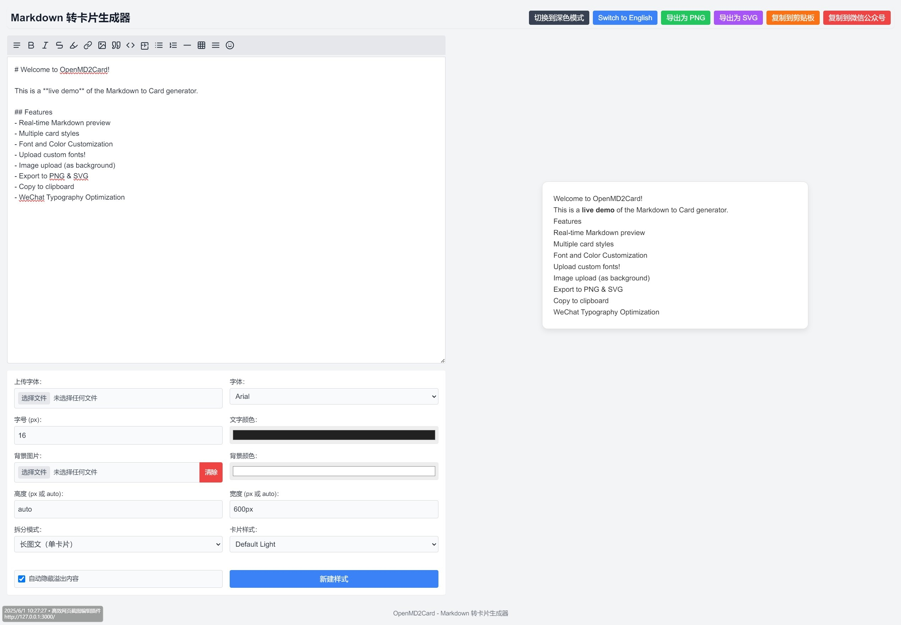

# OpenMD2Card - Markdown卡片生成器

## 项目介绍

OpenMD2Card 是一个基于 Next.js 开发的 Web 应用，可以将 Markdown 文本转换为精美的卡片图像。该工具支持多种样式、字体和导出功能，适合创建社交媒体分享卡片、文章摘要卡片或其他需要美观展示 Markdown 内容的场景。

## 主要功能

- ✨ 实时 Markdown 预览
- 🎨 多种预设卡片样式
- 🔤 字体和颜色自定义
- 📤 支持上传自定义字体
- 🖼️ 支持上传背景图片
- 💾 导出为 PNG 和 SVG 格式
- 📋 复制到剪贴板
- 📱 微信排版优化
- 📏 自定义卡片尺寸

## 安装步骤

### 前提条件

- Node.js 16.8.0 或更高版本
- npm 包管理器

## 本地开发

启动开发服务器：

```bash
npm run dev
```

打开浏览器访问 [http://localhost:3000](http://localhost:3000) 即可查看应用。

## 使用指南

1. 在左侧文本框中输入 Markdown 内容
2. 在右侧实时预览卡片效果
3. 使用样式选择器选择预设样式
4. 自定义字体、颜色和背景
5. 可选择上传自定义字体和背景图片
6. 使用导出按钮将卡片保存为 PNG 或 SVG 格式
7. 使用复制按钮将卡片复制到剪贴板

### 自定义字体

除了系统预设字体外，您还可以上传自定义字体文件（支持 .ttf、.otf、.woff 和 .woff2 格式）。上传后的字体将立即应用于卡片预览。

### 背景图片设置

您可以上传自定义背景图片，并调整其透明度、模糊度和位置，以创建独特的卡片效果。

## 常见问题解答

### Q: 为什么我的卡片在导出时出现样式丢失？

A: 这可能是由于自定义字体或特殊样式未能正确加载。请确保您使用的字体已正确上传，或尝试使用系统预设字体。

### Q: 如何在卡片中使用自定义 CSS？

A: 目前版本不直接支持在 Markdown 中嵌入自定义 CSS。您可以通过选择预设样式并调整颜色、字体等参数来自定义卡片外观。

## 项目结构

```
OpenMD2Card/
├── src/                      # 源代码目录
│   ├── app/                  # Next.js 应用主目录
│   │   ├── globals.css       # 全局样式文件
│   │   ├── layout.tsx        # 应用布局组件
│   │   └── page.tsx          # 主页面组件
│   └── components/           # React 组件目录
│       └── MarkdownCardGenerator.tsx  # Markdown 卡片生成器组件
├── .next/                    # Next.js 构建输出目录
├── package.json             # 项目依赖配置
├── package-lock.json        # 依赖版本锁定文件
├── next-env.d.ts           # Next.js TypeScript 声明文件
├── postcss.config.js       # PostCSS 配置文件
├── tailwind.config.js      # Tailwind CSS 配置文件
└── tsconfig.json           # TypeScript 配置文件
```

### 目录说明

- `src/app/`: Next.js 13+ 应用目录，包含页面和布局组件
- `src/components/`: 可复用的 React 组件
- `.next/`: Next.js 构建产物和缓存
- 根目录配置文件：用于配置 TypeScript、Tailwind CSS 等工具

## 技术栈

- Next.js 15.1.4 - React 框架
- React 19.0.0 - 用户界面库
- TypeScript 5.x - 类型安全的 JavaScript
- Marked 15.0.11 - Markdown 解析
- html-to-image 1.11.13 - 将 HTML 元素转换为图像
- Tailwind CSS 3.4.1 - 实用优先的 CSS 框架

## 网站界面


